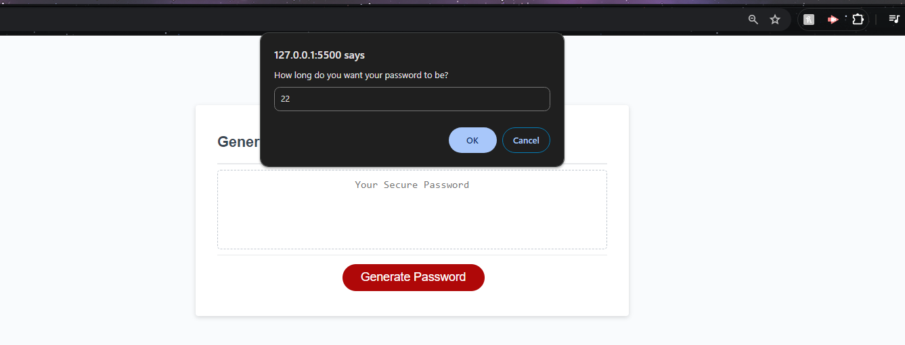
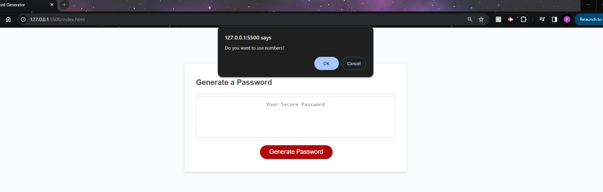
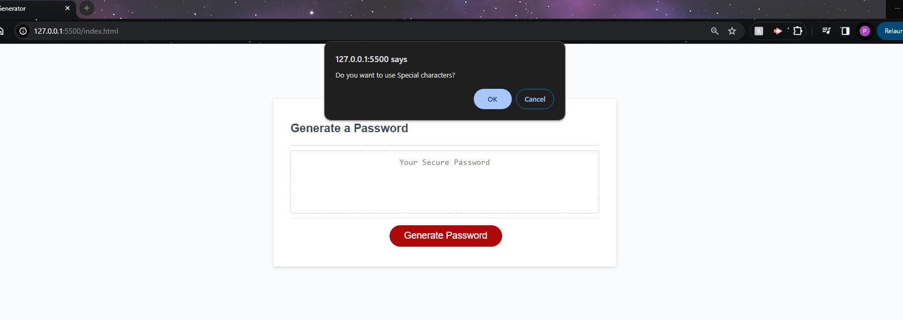
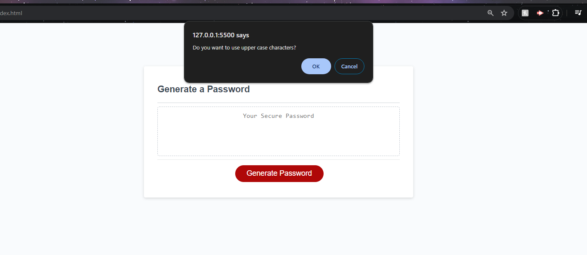
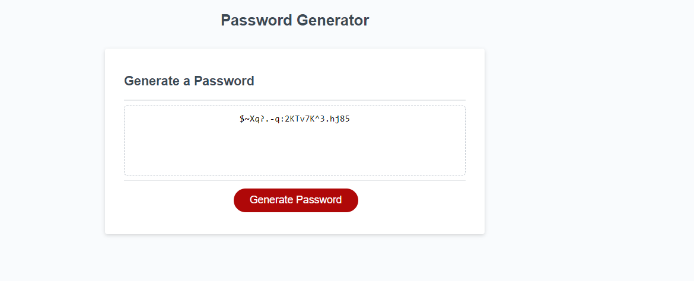

# Module 5 Challenge: Password Generator

## Overview

Link to webpage: https://ptak18.github.io/password-generator/

Github repository: https://github.com/ptak18/password-generator

Password Generator Challenge

This challenge requires you to create an application that generates random passwords based on criteria selected by the user. The application should be written in JavaScript and have a clean and polished user interface that is responsive to different screen sizes.

Requirements
The application must meet the following requirements:

*Generate a password when the button is clicked.

*Present a series of prompts for password criteria:

Length of password: At least 8 characters but no more than 128.
Character types: Lowercase, uppercase, numeric, special characters ($@%&*, etc.)
Validate user input:

*Ensure the password length is within the specified range.
*Ensure at least one character type has been selected.
*Generate and display the password:

Once all prompts are answered, generate a password that meets the selected criteria.
Display the password in an alert or written to the page.

Example with some images to test out the code. I opted to go for 22 characters.

 Prompt to use numbers

 Prompt to use Special Characters

 Prompt for Uppercase Characters

 An example showing a 22 character password, as opted for in the first prompt, when button is clicked.   